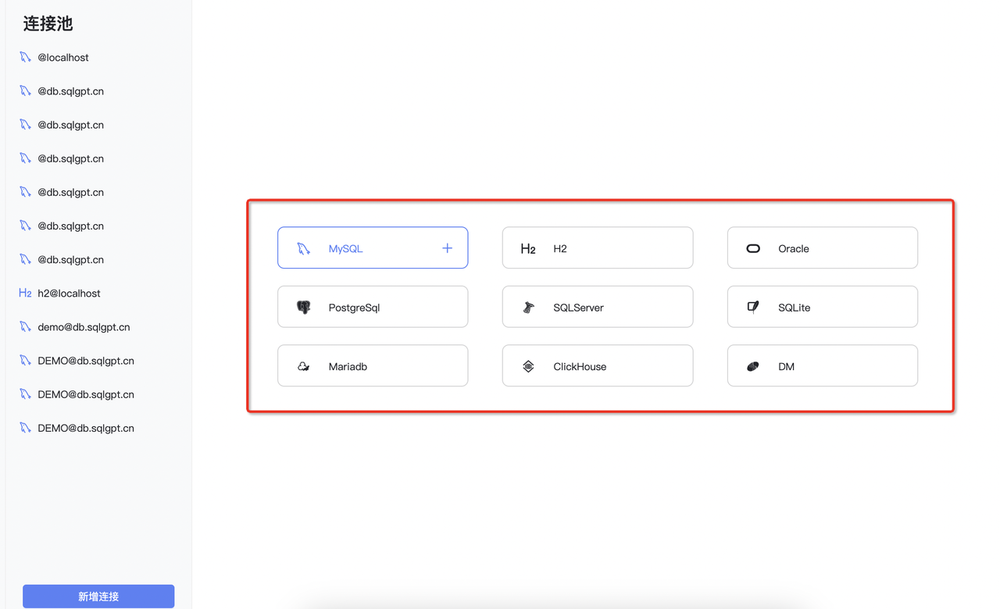
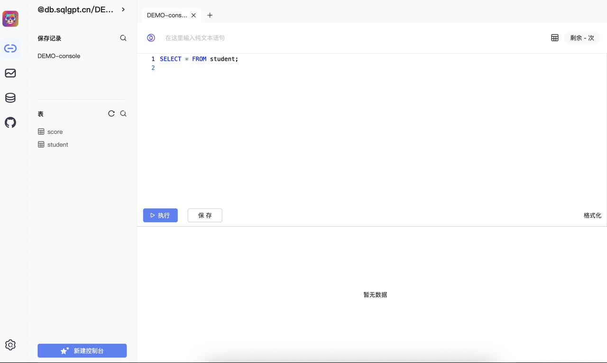
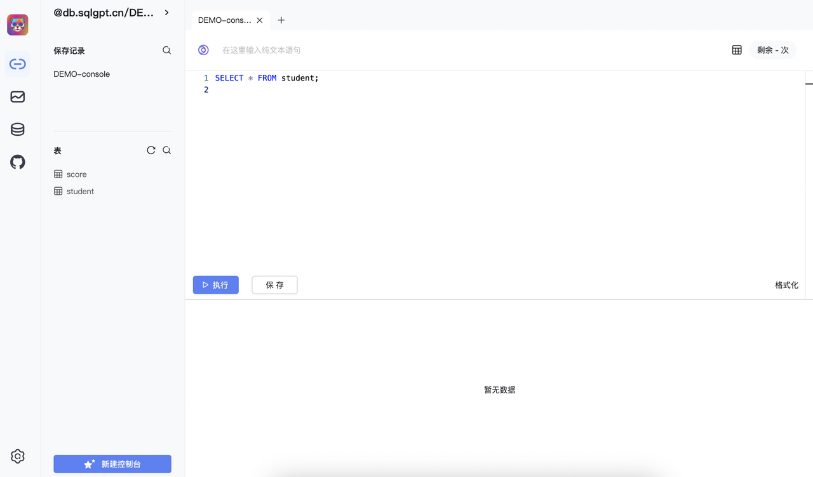
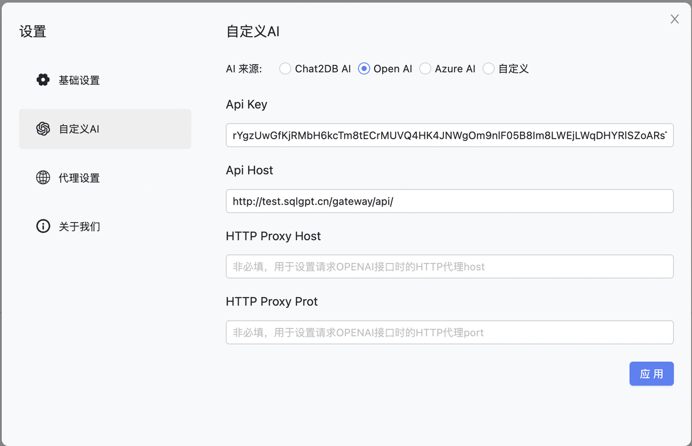
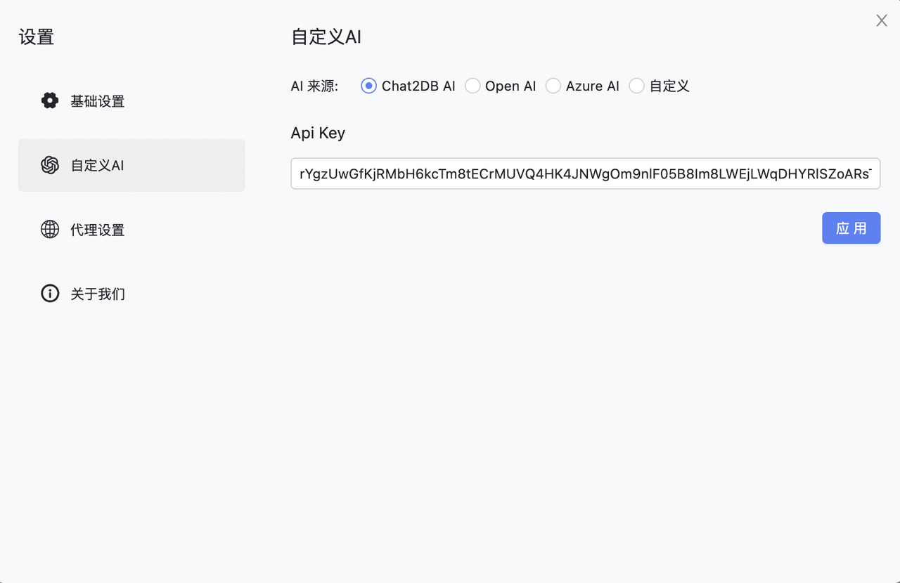

<h1 align="center">Chat2DB</h1>

<div align="center">

 智能且多功能的SQL客户端和报表工具，适用于各种数据库


## 案例视频

https://github.com/chat2db/Chat2DB/assets/22975773/b58db908-5768-4a71-aa30-135d202e505f


## 📖 简介
&emsp; &emsp;Chat2DB 是一款有开源免费的多数据库客户端工具，支持windows、mac本地安装，也支持服务器端部署，web网页访问。和传统的数据库客户端软件Navicat、DBeaver 相比Chat2DB集成了AIGC的能力，能够将自然语言转换为SQL，也可以将SQL转换为自然语言，可以给出研发人员SQL的优化建议，极大的提升人员的效率，是AI时代数据库研发人员的利器，未来即使不懂SQL的运营业务也可以使用快速查询业务数据、生成报表能力。
## ✨ 特性
- 🌈 AI智能助手，支持自然语言转SQL、SQL转自然语言、SQL优化建议
- 🔥 SQL查询、AI查询和数据报表完美集成的一体化解决方案设计与实现
- 👭 支持团队协作，研发无需知道线上数据库密码，解决企业数据库账号安全问题
- ⚙️ 强大的数据管理能力，支持数据表、视图、存储过程、函数、触发器、索引、序列、用户、角色、授权等管理
- 🔌 强大的扩展能力，目前已经支持MySQL、PostgreSQL、Oracle、SQLServer、ClickHouse、OceanBase、H2、SQLite等等，未来会支持更多的数据库
- 🛡 前端使用 Electron 开发，提供 Windows、Mac、Linux 客户端、网页版本一体化的解决方案
- 🎁 支持环境隔离、线上、日常数据权限分离

## 产品展示


## ⏬ 下载安装
| 描述                    | 下载地址                                                     |
| ----------------------- | ------------------------------------------------------------ |
| Windows                 | [https://oss-chat2db.alibaba.com/release/2.0.1/Chat2DB%20Setup%202.0.1.exe](https://oss-chat2db.alibaba.com/release/2.0.1/Chat2DB%20Setup%202.0.1.exe) |
| MacOS ARM64 (Apple芯片) | [https://oss-chat2db.alibaba.com/release/2.0.1/Chat2DB-2.0.1-arm64.dmg](https://oss-chat2db.alibaba.com/release/2.0.1/Chat2DB-2.0.1-arm64.dmg) |
| MacOS X64 (Intel芯片)   | [https://oss-chat2db.alibaba.com/release/2.0.1/Chat2DB-2.0.1.dmg](https://oss-chat2db.alibaba.com/release/2.0.1/Chat2DB-2.0.1.dmg) |
| Jar包                   | [https://oss-chat2db.alibaba.com/release/2.0.1/chat2db-server-start.jar](https://oss-chat2db.alibaba.com/release/2.0.1/chat2db-server-start.jar) |

## 🚀 支持的数据库
| 数据库        | 支持计划 |
| ------------- | -------- |
| Mysql         | ✅        |
| H2            | ✅        |
| Oracle        | ✅        |
| PostgreSQL    | ✅        |
| SQLServer     | ✅        |
| SQLLite       | ✅        |
| MariaDB       | ✅        |
| ClickHouse    | ✅        |
| DM            | ✅        |
| Presto        | ✅        |
| DB2           | ✅        |
| OceanBase     | ✅        |
| Redis         | ✅        |
| Hive          | ✅        |
| KingBase      | ✅        |
| MongoDB       | ✅        |
| Hbase         | Planning |
| Elasticsearch | Planning |
| openGauss     | Planning |
| TiDB          | Planning |
| InfluxDB      | Planning |
## 🌰 使用Demo
### 创建数据源
<a></a>

### 数据源管理
<a></a>

### SQL控制台 及 AI智能助手
#### 使用前需要配置OpenAI的Api Key及本地代理配置
<a></a>
<a></a>


## 🔥 AI配置
### 使用ChatGPT
方式一（推荐）：使用OPENAI的ChatSql功能需要满足两个条件
- 1、需要有一个openAI的key：OPENAI_API_KEY
- 2、客户端网络可以连接到OPENAI官网，国内需要科学上网。注意：如果本地VPN未能全局生效，可以通过在客户端中设置网络代理HOST和PORT来保证网络连通性
-
<a></a>

方式二（推荐）：使用我们提供了一个统一的代理服务。
- 1、不需要openAI的key
- 2、不需要代理，不需要VPN只要可以联网即可使用。

为了方便大家更快速的使用AI的能力，可以关注微信公众号，回复"AI" 获得我们的自定义API_KEY，申请完成之后参考下图进行配置即可进行使用

<a></a>


## 📦 Docker部署

```bash
  docker pull chat2db/chat2db:latest
  // 前台运行,运行后不能关闭命令行
  docker run -ti --name=chat2db -p 10824:10824 chat2db/chat2db:latest
  // 后台运行,运行后可以关闭命令行
  docker run --name=chat2db -p 10824:10824 chat2db/chat2db:latest
  // 这里正常会提示 Tomcat started on port(s): 10824 (http) with context path 就可以结束了
  
  // 如果这里提示  The container name "/chat2db" is already in use by container, 代表已经存在容器了 运行
  dcoker run chat2db
  // 如果想更新chat2db 则需要先rm 再运行
  dcoker rm chat2db
```
## 🎯 运行环境
注意：
如果需要本地调试
- java运行 <a href="https://adoptopenjdk.net/" target="_blank">Open JDK 17</a>
- Node运行环境Node16 <a href="https://nodejs.org/" target="_blank">Node.js</a>.
## 💻 本地调试
- git clone到本地
```bash
$ git clone git@github.com:chat2db/Chat2DB.git
```
- 前端安装
```bash
$ cd Chat2DB/chat2db-client
$ npm install # 安装前端依赖
$ npm run build:prod # 把js打包生成到后端的source目录
```
- 后端调试
```bash
$ cd ../chat2db-server
$ mvn clean install # 需要安装maven 3.8以上版本
$ cd chat2db-server/chat2db-server-start/target/
$ java -jar -Dchatgpt.apiKey=xxxxx chat2db-server-start.jar  # 启动应用 chatgpt.apiKey 需要输入ChatGPT的key,如果不输入无法使用AIGC功能
$ # 打开 http://127.0.0.1:10821 开启调试 注：需要进行前端安装
```

- 前端调试
```bash
$ cd Chat2DB/chat2db-client
$ npm install 
$ npm run start
$ # 打开 http://127.0.0.1:10821 开启前端调试
$ # 注：前端页面完全赖服务，所以前端同学调试也需要把后端项目跑起来
```
但是前端调试需要映射下资源，可以下载[XSwitch](https://chrome.google.com/webstore/detail/idkjhjggpffolpidfkikidcokdkdaogg),添加以下配置文件
``` json
{
  "proxy": [
    [
      "http://127.0.0.1:10821/(.*).js$",
      "http://127.0.0.1:8001/$1.js",
    ],
    [
      "http://127.0.0.1:10821/(.*).css$",
      "http://127.0.0.1:8001/$1.css",
    ],
    [
      "http://127.0.0.1:10821/static/front/(.*)",
      "http://127.0.0.1:8001/$1",
    ],
    [
      "http://127.0.0.1:10821/static/(.*)$",
      "http://127.0.0.1:8001/static/$1",
    ],
  ],
}
```


## 📑 文档

* <a href="https://chat2db.opensource.alibaba.com">官方文档</a>
* <a href="https://github.com/chat2db/Chat2DB/issues">Issue</a>

##  常见问题

### 1、无法获取数据源驱动:getJDBCDriver error: null

问题原因：无法联网导致下载数据库驱动包失败。

解决办法：手动下载相关驱动放入到 ~/.chat2db/jdbc-lib 目录下

下载链接 参考：<a href="https://github.com/chat2db/Chat2DB/blob/main/chat2db-server/chat2db-server-start/src/main/resources/application.yml">Application jdbc-jar-downLoad-urls</a>
- https://oss-chat2db.alibaba.com/lib/mysql-connector-java-8.0.30.jar
- https://oss-chat2db.alibaba.com/lib/mysql-connector-java-5.1.47.jar
- https://oss-chat2db.alibaba.com/lib/clickhouse-jdbc-0.3.2-patch8-http.jar
- https://oss-chat2db.alibaba.com/lib/mariadb-java-client-3.0.8.jar
- https://oss-chat2db.alibaba.com/lib/mssql-jdbc-11.2.1.jre17.jar
- https://oss-chat2db.alibaba.com/lib/oceanbase-client-2.4.2.jar
- https://oss-chat2db.alibaba.com/lib/postgresql-42.5.1.jar
- https://oss-chat2db.alibaba.com/lib/sqlite-jdbc-3.39.3.0.jar
- https://oss-chat2db.alibaba.com/lib/ojdbc11.jar
